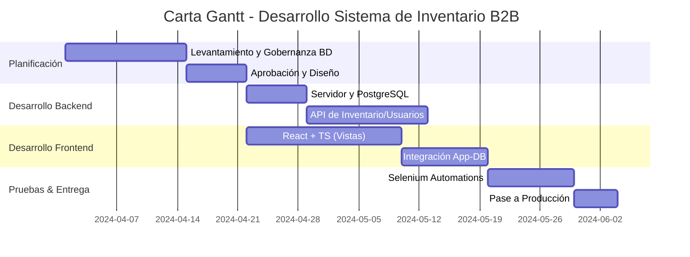

# Documento de Apoyo y Guión: Proyecto de Título

Este documento incluye el **Guión paso a paso** para que sepas exactamente qué decir al mostrar la presentación, además de mantener toda tu "tarea para la casa" (justificación de herramientas, Gantt, Leyes, etc.).

---

## 🎯 GUIÓN DE PRESENTACIÓN (Qué decir en cada diapositiva)

### Diapositiva 1: Contexto Actual
*"Actualmente la empresa atiende ventas B2B (al por mayor) logrando agilidad mediante WhatsApp. Tienen un sistema de ventas en caja, pero el problema grave radica en el inventario: dependemos de un archivo de Excel manual que se actualiza despachando las facturas de a poco. Esto significa que los vendedores cierran ventas a ciegas, sin saber si el stock real en bodega coincide con el Excel."*

### Diapositiva 2: Capa de Negocio
*"Si le fallamos a un cliente minorista (B2C), perdemos una venta pequeña. Pero en nuestro modelo B2B, fallarle a una empresa por quiebre de stock arriesga un contrato grande. La desconexión entre el POS y la bodega es nuestro punto de falla. Este proyecto sentará las bases de **Gobernanza Digital** para que, el día de mañana, la empresa pueda lanzar un Ecommerce y el stock se refleje en tiempo real."*

### Diapositiva 3: Propuesta Tecnológica (Backend y BD)
*"Para crear este puente digital y dejar atrás el Excel, diseñé el núcleo del sistema con dos pilares: 
*   Empezando por **PostgreSQL (BD):** Lo elegí porque en temas de plata e inventario necesitamos integridad estricta (ACID). Se implementará como nuestra única fuente de verdad conteniendo todo nuestro modelo relacional.
*   Y como nexo, usare **Node.js (Backend):** Lo usaré porque es altísimamente rápido y escalable. Se programará allí la API que actuará como "cerebro" recibiendo las órdenes y aplicando reglas de negocio antes de tocar la BD."*

### Diapositiva 4: Propuesta Tecnológica (Frontend y QA)
*"Por el lado del cliente y la calidad técnica del software:
*   Usaremos **React + TypeScript (Front):** Lo escogí para evitar los bugs humanos. Se usará para crear nuestro panel gráfico o Dashboard web, donde los vendedores operarán los flujos validados gracias al tipado estricto del código.
*   Finalmente, en mi rol de Ingeniero, usaré **Selenium (Automations):** Lo escogí porque testear un inventario a mano toma horas. Desarrollaré scripts automáticos de QA que validarán silenciosamente que el descuento en bodega efectivamente funcione antes de usarlo en producción."*

### Diapositiva 5: Gobernanza de Datos
*"Gobernanza no es solo almacenar datos, es que sean confiables y seguros. Aplicaremos restricciones estrictas en la BD (ej. prohibir números negativos para stock físico) y trazabilidad permanente (Auditoría: saber quién, cuándo y por qué modificó el valor en bodega)."*

### Diapositiva 6: Seguridad de Datos
*"El inventario vale dinero líquido. Tendremos Control de Acceso por Roles (RBAC). El vendedor vende, pero ni él ni el cajero pueden editar los números brutos de la bodega (eso lo restringe el PO/Administrador). Sumado a encriptación de contraseñas de sesión e inyecciones SQL neutralizadas en el código."*

### Diapositiva 7: Leyes y Compliance
*"Todo esto robustece legalmente a la gerencia. Con la Ley 21.719 (Delitos Económicos), un inventario no gobernable es un riesgo de fraude en la empresa. Nuestro sistema auditable blinda la operación, fomenta la resiliencia operativa según la Ley 21.663, y vela por el manejo privado de las bases de clientes de manera segura."*

---

## 🛠️ TAREA PARA LA CASA (Apuntes Técnicos Profundos)

### 1. Justificación Detallada: CÓMO y POR QUÉ del Stack Tecnológico

A continuación el desglose técnico exacto de por qué escogiste estas herramientas y cómo las llevarás a la práctica:

*   **Node.js (Lógica de Servidor / Backend)**
    *   **Por qué:** Posee una arquitectura "asíncrona no bloqueante". Esto significa que si tiene 50 vendedores haciendo consultas de stock al mismo tiempo desde WhatsApp/Ecommerce, no se "cuelga" esperando a uno para atender al otro (ideal para alta concurrencia).
    *   **Cómo se implementará:** Levantaremos un servidor intermedio que será una "API REST". Esta API recibirá el producto vendido en la caja, calculará si se puede lograr la venta (reglas de negocio) y le enviará la orden a la base de datos de descontar el producto.

*   **PostgreSQL (Base de Datos)**
    *   **Por qué:** Para aplicaciones de inventario B2B o financieras, la consistencia no es negociable; un dato perdido es plata perdida. Postgres cumple con las pautas **ACID** (Atomicidad, Consistencia, Aislamiento, Durabilidad), garantizando que tu información se guarda en base a un esquema estricto, sin perder información por fallos eléctricos.
    *   **Cómo se implementará:** Habrá tablas estructuradas para "Usuarios", "Roles", "Productos" y "Transacciones". A esta BD se le aplicarán *Constraints* físicas directas (ej: que la columna `stock_cantidad` no corra el riesgo de recibir letras por error, o nunca sea menor a cero).

*   **React + TypeScript (Interfaz Visual / Frontend)**
    *   **Por qué:** React permite hacer páneles de administración web (Dashboards) ultra rápidos que no recargan la página como las webs antiguas. Al combinarlo con **TypeScript**, le otorgamos al código una regla estricta de "tipos de datos", previniendo que tu sistema explote cuando un trabajador intente ingresar un dato inesperado.
    *   **Cómo se implementará:** Consumirá nuestra API de Node.js. Aquí residirán las tablas visuales de los productos en pantalla con sus opciones gráficas para añadir/restar mercadería con botones limpios.

*   **Selenium (Rol de Ingeniero QA / Automatización de Pruebas)**
    *   **Por qué:** Un ciclo de desarrollo sano requiere pruebas rigurosas. En un proyecto de título tan importante, demostrar que configuras herramientas QA para probar tu propia aplicación automáticamente te sube la nota enormemente.
    *   **Cómo se implementará:** Programaremos scripts informáticos (bots). Cuando se ejecuten, Selenium abrirá mágicamente un navegador web invisible, rellenará un formulario de venta de prueba y verificará matemáticamente en la BD que el descuento fue exitoso.

### 2. ¿Cómo funciona Antigravity?
Soy **Antigravity**, un asistente de inteligencia artificial avanzado desarrollado por Google especializado en desarrollo de software. Funciono procesando lenguaje natural para razonar sobre arquitectura técnica y escribir archivos o comandos directamente en tu computadora. En tu proyecto, opero como tu "arquitecto de software o co-piloto", apoyándote a redactar la documentación técnica y programar el software bajo instrucciones de grado empresarial.

### 3. Carta Gantt
Copia y pega este bloque en Markdown para ver la Gantt visual en formato Mermaid.

